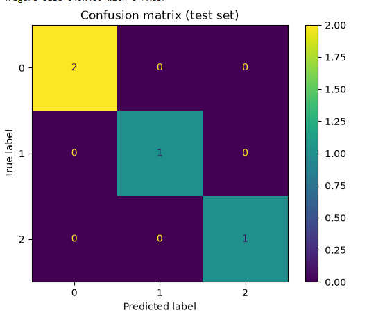

# Project Documentation

This site provides project documentation.
Use the documentation navigation to explore.

## How-To Guide

Many instructions are common to all our projects.

See
[⭐ **Workflow: Apply Example**](https://denisecase.github.io/pro-analytics-02/workflow-b-apply-example-project/)
to get the example projects running on your machine.

## Project Documentation Pages (docs/)

- **Home** - this documentation landing page
- [**Project Instructions**](./project-instructions.md)  - the standard project workflow
- [**Your Files**](./your-files.md) - how to copy the example and create your version
- [**Glossary**](./glossary.md) - project terms and concepts
- [**API**](./api.md) - autogenerated code documentation for the public project interface

## Phase 4. Technical Modification

Describe your small technical modification to the example project.

- What you changed: I added data pre-processing steps for scaling and encoding categorical variables.
-   Implemented classification models based on the changes.
-   Enhanced visualizations for confusion matrices.
- Why you chose that change:   I made these chanes to improve the model generalization and reduce overfitting.
-   Provide clear visual diagnosis for model performance.
-
- How you verified that it worked- Yes the changes were verified and visible changes were noticed after modifying the model.
- What result, output, chart, metric, or behavior confirmed the change
   The Decision tree showed high training accuracy
but lower test accuracy as a sign of overfitting.
Compared with the example project,
explain what is different and why the change matters. The example project used the built in Seaborn-pengiuins dataset , whereas my project used a custom CSV dataset penguin_neighbor.csv
that needed fixing encoding, correcting and cleaning inconsitent data, ensuring each sample had enough samples to run the model. The example project predicts species, my project predicts the neighborhood from the sample.

Was it easy, or surprisingly challenging and why do you think so?
  It was challenging to apply a right dataset and to do the cleaning process and train the model however the concept was straightforward.

## Phase 5. Custom Project

Describe your custom project and how you made your modeling decisions.

Be specific about what changed from the example project.

My custom project extends the example classification  notebook by replacing built-in seaborn dataset with custom csv named penguin_neighbor.csv. The example project predicts species and my project predicts the neighborhood, a categorial feature that required significant data cleaning and preparation for modelling. I kept the modelling structure from the example and adapted the dataset.

### Basis and Data

Describe the dataset, input, or example you started with.

Include:

- The original example dataset or input  The original example uses a built-in Seaborn penguins dataset. The dataset was already clean, balanced and formatted.
- My custom project, I replaced the dataset with a synthetic CSV file named penguin_neighbor.csv. The file contains Penguin measurements along with a categorial feature called neighborhood. I chose this dataset because it allowed me to practice data cleaning tasks.
However, the dataset had several limitations like too few sample size, encoding issues when loading the file.
They affected the ability to perform a train /test split sice there were too less of samples , and I directectly renamed an .xlsx file to a .csv file which created encoding issues which was later fixed.

### Modeling Approach

Describe the problem type and modeling approach for this project.

Include:

- Is this supervised or unsupervised and how do you know  This project is a supervised machine learning problem because the dataset included a target column neighborhood.
- Is this classification, regression, clustering, recommendation, forecasting, or another type of ML task  The target is a categorial cariable so the correct modelling approach is classification.
- What kind of target works well for this approach A decision tree classifier works well as it handles categorial targets and performs well for a small dataset.
- Why your selected model or method is appropriate
My selected model is trained to perform on a small dataset and it works with numeric and categorial features.
### Target

Describe the example target variable.
THe example project has species as the target variable.
Then describe your chosen target variable.
In my custom project the target variable was Neighborhood which had inconsistent formatting and had too few samples per class.

Explain how your target choice changes the modeling approach, interpretation, or evaluation.
  changing the target changed the confusion matrix, and interpreting results changed.
### Features

Describe the example features.

The example project uses the following features:
  bill length
    bill depth
      flipper length
        body mass
          sex
            island

Then describe the features you used to predict your target.

For my custom project has the     following features:
     bill_length_mm
     bil_depth_mm
     species
     island

Explain what you changed, added, removed, or kept and why.
  I removed flipper length and body mass because they were not included in CSV. I added few more sample rows as the sample size on my custom project was rtoo small.
  The above changes matter because of model accuracy, decision boundaries, interpretability.

### Evaluation and Results

Describe how you evaluated your model.

using accuracy scores,
  classification report
    confusion matrix
      The main result was that the decisiontree classifier with max_depth =3 performed well on clean dataset.

        The confusion matrix showed correct predictions for most instances across all neighborhood.
### Summary

Summarize your custom project.

Include:

In this custom project, I replaced the example dataset with a manually created CSV and predicted a new target variable "neighborhood". I cleaned the dataset, normalized categories, added more records to the sample for staratification.

The model achieved strong results and produced clear confusion matrix.

This project helped me understand small inconsistencies in real world can break ML workflows. These skills can be applied to real world problems such as customer segmentation, location prediction.

Display at least one image or screenshot showing your work.

